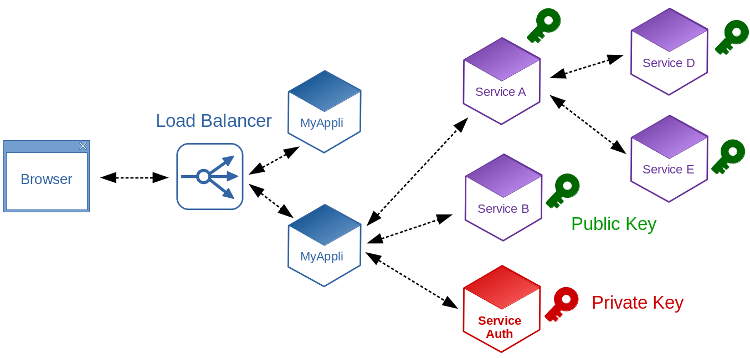

# tornado-keycloak-auth

Simple authentication handler to allow tornado microservice to check sso tokens.
Work fine with Keycloak.
The handler can be improve with a check of user roles...

# Retrieve JWK from server
 - JWK contains public key that is used for decode JWT token
 - Only keycloak server know private key and can generate tokens
 - Token signature can be check with the public key

